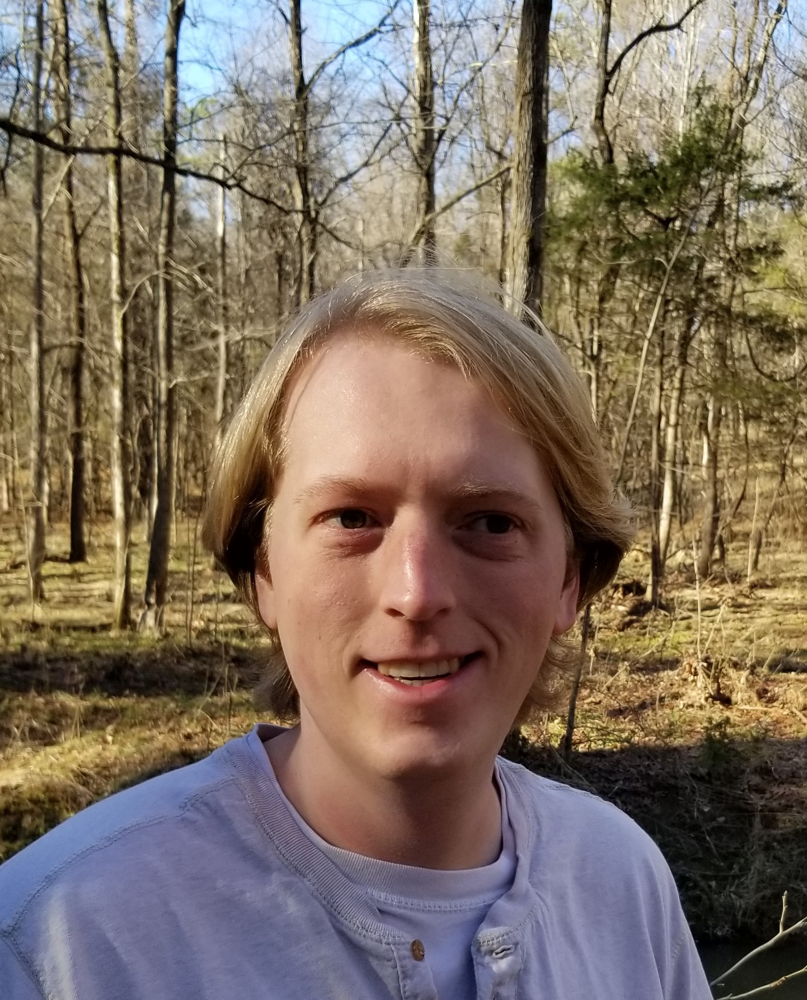

  

  

    Welcome!  I am a Computer Science Lecturer at <a href="https://bowdoin.edu">Bowdoin College</a>.  I completed my PhD in Computer Science, titled "Supporting Computer Science Education Through Automation and Surveys" under the direction of <a href="http://kstolee.github.io/">Dr. Kathryn Stolee</a> and <a href="https://people.engr.ncsu.edu/sesmith5/">Dr. Sarah Heckman</a>.  My <a href="research.html">research</a> interests lie at the intersection of computer science education and software engineering.  I am particularly interested in research that can help promote effective teaming environments in computer science education.  I have maintained an active <a href="teaching.html">teaching</a> profile.

	 
    For more information, please check out the links to the left.  
  

